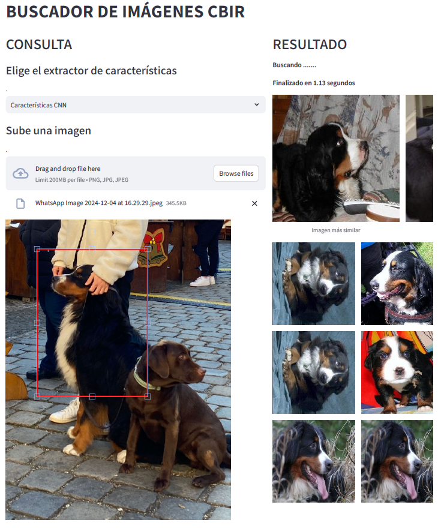

# Sistema CBIR - Recuperación de Imágenes Basado en Contenido

Este repositorio implementa un sistema CBIR (Content-Based Image Retrieval) que utiliza características visuales extraídas de imágenes para buscar imágenes similares en una base de datos.

---

## Tabla de Contenidos
1. [Descripción del Proyecto](#descripción-del-proyecto)
2. [Enlaces de Descarga](#enlaces-de-descarga)
3. [Estructura del Proyecto](#estructura-del-proyecto)
4. [Instrucciones de Instalación](#instrucciones-de-instalación)
5. [Uso del Sistema](#uso-del-sistema)
6. [Resultados](#resultados)

---

## Descripción del Proyecto

El sistema de Recuperación de Imágenes Basado en Contenido (CBIR) surge como una solución eficiente al permitir la búsqueda de imágenes similares basándose en sus características visuales. Este proyecto utiliza el Dogs and Cats Breed Classification Dataset, que contiene imágenes variadas de diferentes razas de perros y gatos, para desarrollar un sistema CBIR.
El proyecto emplea imágenes del dataset [Dogs and Cats Breed Classification Dataset](https://universe.roboflow.com/ldrago/dogs-and-cats-breed-detector
)

---

## Enlaces de Descarga

1. **Imágenes Utilizadas:**
   - [Conjunto de raw (`raw`)](https://universe.roboflow.com/ldrago/dogs-and-cats-breed-detector
   )
   - [Imágenes Preprocesadas (`preprocessed`)](https://drive.google.com/file/d/1F6rw-2WegNB1t4ahD2hvxrTgVStR5EqF/view?usp=drive_link)

2. **Archivos Intermedios:**
   - [Características Calculadas (`npy`) y Escaladores (`pkl`)](https://drive.google.com/file/d/16I4gBXa-CtIqEGW1XvALs5nC-ozI_Ewo/view?usp=drive_link)
   - [Índices Generados (`index`)](https://drive.google.com/file/d/1-2I_3YyYnAaRAG6KAB-ZZk6GH5V4W6b0/view?usp=drive_link)

---

## Estructura del Proyecto

```plaintext
CBIR/
├── Data/
│   ├── raw/                       # Imágenes originales organizadas por uso
│   │   ├── train/                 # Imágenes para entrenamiento
│   │   ├── validation/            # Imágenes para validación
│   │   ├── test/                  # Imágenes para prueba
│   │   └── df.csv                 # DataFrame con rutas de imágenes y etiquetas
│   ├── preprocessed/              # Imágenes preprocesadas
│   └── processed/
│       ├── npy/                   # Archivos .npy con características extraídas
│       └── scalers/               # Escaladores normalizados
├── indices/                       # Índices FAISS
├── notebooks/                     # Jupyter Notebooks
│   └── feature_extraction.ipynb   # Notebook para extracción de características
├── src/                           # Código fuente
│   ├── app.py                     # Interfaz Streamlit
│   ├── functions.py               # Funciones auxiliares
│   ├── index_creation.py          # Creación de índices
│   └── main.py                    
├── .gitignore                     # Archivos a ignorar por Git
├── README.md                      # Documentación del proyecto
└── requirements.txt               # Librerías necesarias
```

---

## Instrucciones de Instalación

### 1. Clonar el repositorio
Clona este repositorio en tu máquina local:
```bash
git clone https://github.com/tu_usuario/CBIR.git
cd CBIR
```

### 2. Instalar las dependencias
Se recomienda usar un entorno virtual para evitar conflictos con las librerías instaladas globalmente:
```bash
python -m venv cbir_env
source cbir_env/bin/activate  # En Windows: cbir_env\Scripts\activate
pip install -r requirements.txt
```

### 3. Descargar y Colocar los Archivos
Descarga las imágenes y archivos intermedios desde los enlaces proporcionados y colócalos en las carpetas adecuadas:
- Coloca las imágenes en:
  - `Data/` para las imágenes de crudas.
- Coloca los archivos intermedios en:
  - `Data/` para los archivos de la carpeta processed.
  - `src/` para la carpeta con los archivos `.index` indices con los índices FAISS generados.


---

## Uso del Sistema

### 1. Ejecutar la Interfaz
Utiliza la interfaz de usuario desarrollada en Streamlit para realizar consultas visuales. Ejecuta el siguiente comando:
```bash
streamlit run src/app.py
```

### 2. Realizar una Consulta
1. Sube una imagen de consulta desde la interfaz.
2. Selecciona el extractor de características que deseas usar:
   - **Histograma de Color**
   - **Textura LBP**
   - **Momentos de Hu**
   - **Características CNN**
   - **Características Combinadas**
3. Visualiza las imágenes más similares recuperadas por el sistema.
--- 

## Resultados

A continuación, se muestra cómo funciona mi sistema:


